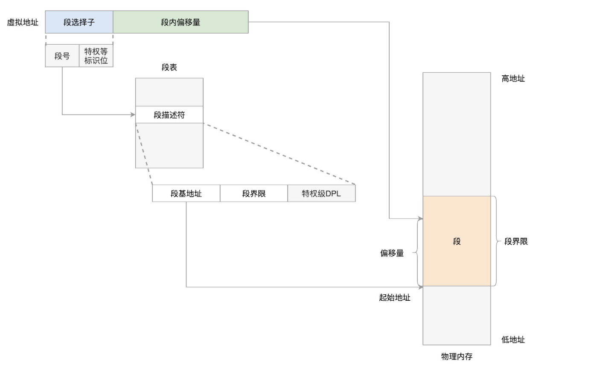
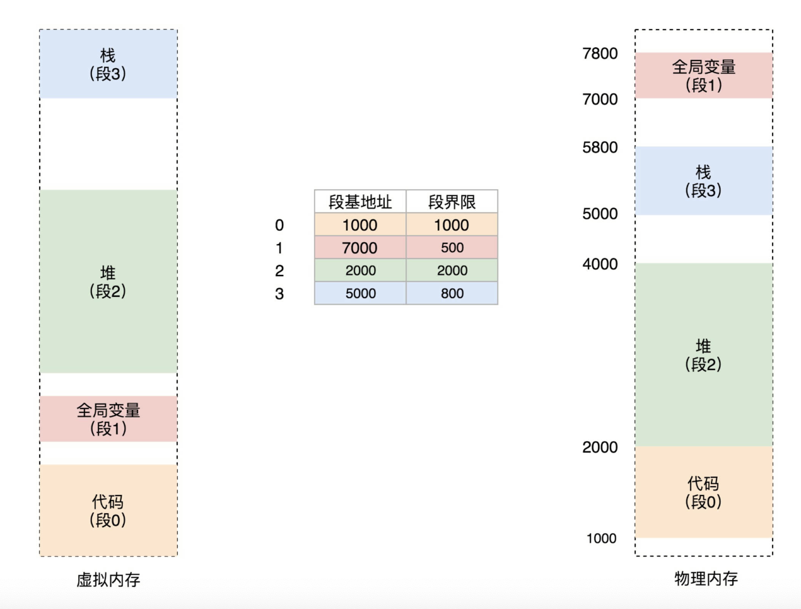
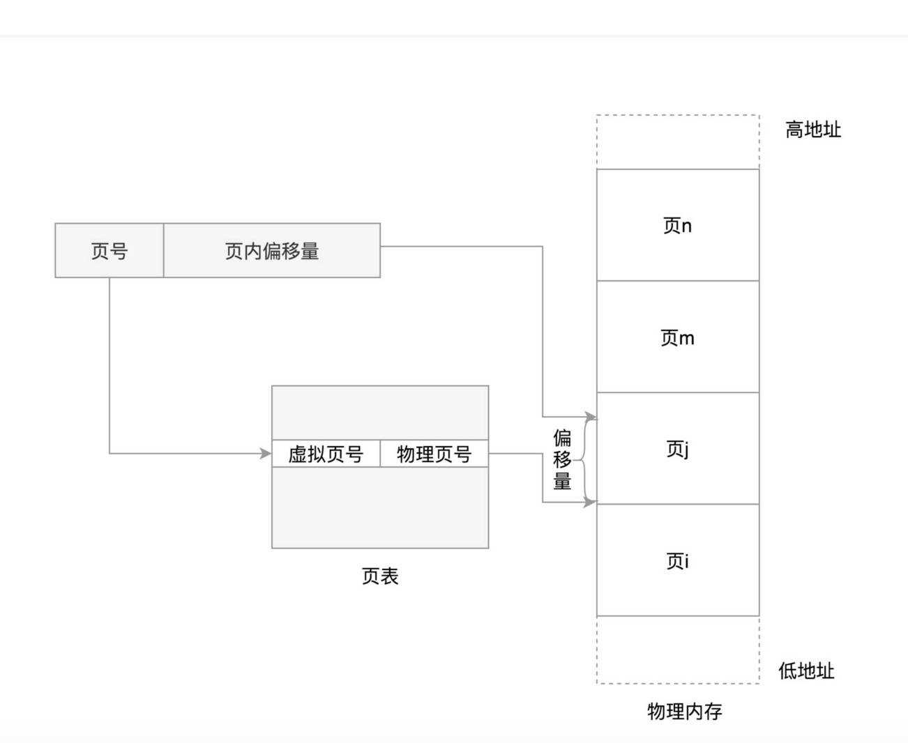

# 内存管理
## 规划虚拟地址
```c
操作系统管理内存:
1.物理内存管理
2.虚拟地址管理
3.虚拟地址和物理地址的映射

例:

int c=200;
main(){
    int rand=random();
    void *p malloc(rand);
    free(p);
}


执行进程需要存放的内容
//用户态
1.代码指令 main 函数 mall random ....函数
2.全局变量数据 c
3.malloc 堆内存
4.glic so文件存放
.....

//内核态
内核代码
内核中全局变量
task_struct 进程的数据
内核栈 
内核也要动态分配内存
虚拟地址到内核的映射表
......


用户态 虚拟地址
内核态 虚拟地址

32 位 4GB
64 位  48位用来寻址 256T

虚拟空间 4GB or  256T
用户态+内核态(普通进程不能访问)


.text 二进制代码
.data 静态常量
.bss 未初始化变量
heap
xxx.so// 内存映射区域
stack
kernel 内核区域
```
## 如何将虚拟空间映射成物理地址


### linux 如何实现段描述表
### GDT 全局描述表
```c
#define GDT_ENTRY(flags, base, limit)			\
	((((base)  & _AC(0xff000000,ULL)) << (56-24)) |	\
	 (((flags) & _AC(0x0000f0ff,ULL)) << 40) |	\
	 (((limit) & _AC(0x000f0000,ULL)) << (48-16)) |	\
	 (((base)  & _AC(0x00ffffff,ULL)) << 16) |	\
	 (((limit) & _AC(0x0000ffff,ULL))))


一个段时由 基地址base + 标识符组成 

gdt 做权限管理
DPL 3 用户态
DPL 0 内核态

```
### Linux 的虚拟另一种虚拟地址转换分页

```
页号+页内偏移 =物理地址
32 位
4GB
page size =0x1000 (4kb)

ff ff ff ff 
[0,fffff] 页号
[0,fff] 偏移


```
