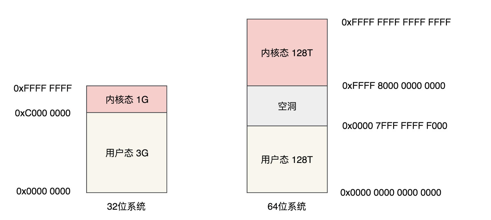

# 进程空间管理

```c
struct task_struct{
    // 该结构题用于内存管理
    struct mm_struct *mm;
}

struct mm_struct{
    // 虚拟内存大小
    unsigned long task_size;
}


task_size
#define TASK_SIZE		(test_thread_flag(TIF_ADDR32) ? \
					IA32_PAGE_OFFSET : TASK_SIZE_MAX)

// 0xc0000000 bytes= 3G
#define IA32_PAGE_OFFSET	((current->personality & ADDR_LIMIT_3GB) ? \
					0xc0000000 : 0xFFFFe000)
// 64 位    1<< 47    -    PAGE_SIZE        =128 T  
#define task_size_max()		((_AC(1,UL) << __VIRTUAL_MASK_SHIFT) - PAGE_SIZE)

进程内存大小设置
void setup_new_exec(struct linux_binprm * bprm)
{
	me->mm->task_size = TASK_SIZE;

}
```
### 用户态布局
```c
struct mm_struct{
    // 双链表 地址从大大小排序
    struct vm_area_struct *mmap;		/* list of VMAs */
	// 红黑树
	struct rb_root mm_rb;

    // 虚拟地址空间内存映射的起始地址
    // malloc  or  .so 就是该内存区域
    unsigned long mmap_base;	/* base of mmap area */
    // 映射页数
    unsigned long total_vm;		/* Total pages mapped */
    // 不能被换出错到磁盘上
    unsigned long locked_vm;	/* Pages that have PG_mlocked set */
    //不能移动也不能换出
    unsigned long pinned_vm;	/* Refcount permanently increased */
    // 数据页数 不能共享 不是栈 可写
    unsigned long data_vm;		/* VM_WRITE & ~VM_SHARED & ~VM_STACK */
    // 可执行
    unsigned long exec_vm;		/* VM_EXEC & ~VM_WRITE & ~VM_STACK */
    //栈
    unsigned long stack_vm;		/* VM_STACK */
    // 代码 数据  开始 结束的位置
    unsigned long start_code, end_code, start_data, end_data;
    // brk 当前堆结束的位置 
    // start_stack 栈的起始位置  
    unsigned long start_brk, brk, start_stack;
    // 存在 栈的环境变量位置
    unsigned long arg_start, arg_end, env_start, env_end;
}


struct vm_area_struct {
	/* The first cache line has the info for VMA tree walking. */
	unsigned long vm_start;		/* Our start address within vm_mm. */
	unsigned long vm_end;		/* The first byte after our end address within vm_mm. */
	/* linked list of VM areas per task, sorted by address */
	struct vm_area_struct *vm_next, *vm_prev;
	// 红黑树区域节点 
    truct rb_node vm_rb;
	struct mm_struct *vm_mm;	/* The address space we belong to. */
	struct list_head anon_vma_chain; /* Serialized by mmap_sem &
					  * page_table_lock */
    // 映射到物理内存                 
	struct anon_vma *anon_vma;	/* Serialized by page_table_lock */
	/* Function pointers to deal with this struct. */
	const struct vm_operations_struct *vm_ops;
    //映射到的文件
	struct file * vm_file;		/* File we map to (can be NULL). */
	void * vm_private_data;		/* was vm_pte (shared mem) */
} __randomize_layout;
```

### 内核态的布局
```
物理内存
[[896M].....]

虚拟地址
[[3G 用户地址][1G内核地址]]
1G内核地址:[[896M].....]
p->v vaddr= paddr+3G
v->p paddr=vaddr-3G;

896M：[[1M 实模式下的代码]+[内核代码]+...]
   内核栈
   页表

896M-1G:(虚拟内存 存在前896M的映射表内)
    
    896end->VMALLOC_START: VMALLOC_START:8M
    
    VMALLOC_START->VMALLOC_END:
        内核动态分配区域
        vmalloc() 分配内存的区域


    PKMAP_BASE FIXADDR_START: 持久内存映射
    alloc_pages()  kmap 映射到该区域
    
    FIXADDR_START - FIXADDRD_TOP 固定映射区域 用于特殊的要求

    
```